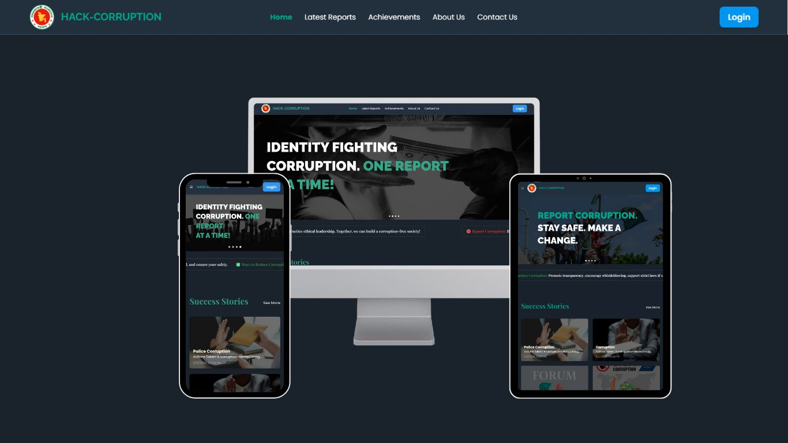

# 🛡️ Hack-Corruption - Anonymous Corruption Reporting Platform

## 📌 Project Overview
**Hack-Corruption** is a secure web application that enables users to report corruption anonymously while ensuring their safety and privacy. Built using the **MERN stack**, this platform leverages AI for automated report descriptions and spam detection, ensuring the authenticity of reports. The platform also allows administrators to manage reports effectively and take necessary actions against corruption cases.

<!--  -->




## 🌐 Live Links
- **Frontend:** [Hack-Corruption Frontend](https://nsu-hack-corruption.web.app/)
- **Backend:** [Hack-Corruption Backend](https://project-hack-backend.vercel.app/)


## 🔑 Admin & User Credentials

To access different features of the platform, use the following credentials:

### 🔹 Admin Credentials:
- **Email:** `yaxiv61217@perceint.com`
- **Password:** `123456`

### 🔹 User Credentials:
- **Email:** `naeemmajumder00@gmail.com`
- **Password:** `123456`

### 🆔 NID & Passport Verification:
- **Sample NID Number:** `2004567890`
- **Sample Passport Number:** `J43210987`

> ⚠️ *Use these credentials for testing purposes only. Update them in the database for production use.*


## 🚀 Key Features
### 🔐 Strong User Authentication
- Users can sign up using **email verification**, **NID verification**, or **passport verification**.
- Ensures only legitimate users can access the platform.

### 🕵️ Anonymous Posting
- Users can **report corruption** anonymously without revealing their identity.
- AI **automatically generates a description** based on the uploaded image.

### 🤖 AI-Powered Spam Detection
- AI analyzes report images and descriptions to **detect spam**.
- Generates an **analysis report** and notifies admins via email.

### 🛡️ Admin Features
- **Ban or Unban Users**: Admins have control over platform access.
- **Success Action Reports**: Admins can post updates on successful actions taken against corruption reports and share them with users.

## 🛠️ Technologies Used
### **Frontend**
- ⚛️ **Framework**: React.js
- 🎨 **Styling**: Tailwind CSS
- 🔄 **State Management**: Context API
- 🔑 **Authentication**: Firebase

### **Backend**
- 🔧 **Framework**: Express.js
- 🗃 **Database**: MongoDB (Local for development, MongoDB Atlas for production)
- 🔗 **ODM**: Mongoose
- 🔑 **Authentication**: Firebase & Custom Verification
- 🤖 **AI Integration**: AI-powered image analysis & spam detection 
- 🌟 **AI Model Used**: Gemini 1.5 Flash AI

## ⚠️ Challenges Faced
### 🏗️ Structuring the Project
- Designing a scalable **folder structure** for both frontend and backend.

### 🤝 Team Collaboration
- This was the **first team project**, so working with different ideas and coordination was challenging.

### 🚀 Deployment Issues
- Facing difficulties in deploying the **frontend on Firebase** and **backend on Vercel**.

### ☁️ Cloud Storage for Images
- Setting up **cloud storage** for securely hosting uploaded images.

## 👥 My Contributions
- Developed the **Home Page** and **Report Creation Form Page**.
- Integrated **AI-powered report descriptions** using uploaded images.
- Built **backend API routes** and connected them with the frontend.
- Designed the **frontend project structure and folder organization**.

## 🛠 Installation and Setup (Local Development)
### 📍 Prerequisites
- **Node.js**
- **MongoDB** (Local or MongoDB Atlas)

### 📂 Frontend Setup
```bash
git clone <frontend-repo-link>
cd frontend
npm install
npm start
```

### 📂 Backend Setup
```bash
git clone <backend-repo-link>
cd backend
npm install
```
#### Set up environment variables in `.env` file:
```env
PORT=8080
MONGODB_URI=<your-mongodb-connection-string>
FIREBASE_CONFIG=<your-firebase-config>
```
#### Run the development server:
```bash
node index.js
```

## 📢 Future Enhancements
- 📊 **Detailed User Analytics**: Insights on reports and trends.
- 📱 **Mobile App**: Companion app for better accessibility.
- 🗣 **Community Engagement**: Users can discuss reported cases anonymously.

## 🤝 Contribution
We welcome contributions! Feel free to **fork** the repository and submit a **pull request**. If you have any suggestions, open an **issue** to discuss new features.

---

🚀 **Empowering users to report corruption safely and anonymously!**